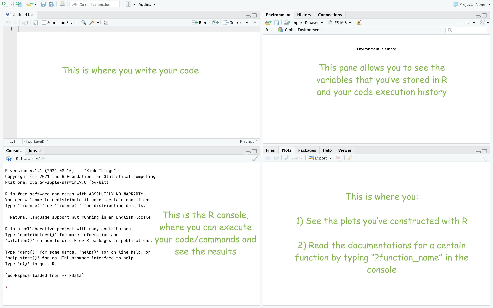

# Chapter 0. Getting things started

# 0.0 Recommended references for R language
One of the advantages of R is that it has an incredibly supportive community. Its affiliating packages are (mostly) well documented, and there are a lot of quality learning resources online. Here are some sources of information that you might consider useful when learning R: 
<ul>
<li><b>[R Documentations](https://www.rdocumentation.org/):</b> Not sure about how to use a function? R Documentations are the best way to get information about a function. </li> 
<li><b>[Stack Overflow](https://stackoverflow.com/):</b> have any questions with any something but can't solve it on your own? Go to stack overflow and post your questions!</li>
<li><b>[codecademy](https://codecademy.com)</b> is a good place to learn about the fundamentals of R. You can start a free account and interact with the coding interface in your browser. 
</ul>

There are also free R programming e-books available online (both in English and Chinese) that you could reference to when you encounter any problems.

### 0.1 Setting things up (for those who already have R/RStudio on their computer, skip this section)
If you do not have R on your computer, go to [the official website of R](https://www.r-project.org/) to download R (I'd recommend version 3 or 4). 

Next, go to [the official website of RStudio](https://www.rstudio.com/products/rstudio/) to get the <b>open source edition</b> of RStudio. It's free. 
While it is not mandatory, I'd still recommend getting RStudio because it is much more "aesthetic" than the original R interface. Also, it offers syntax highlighting tools, integrated plotting environment, auto completion of code by pressing tab key, and many other functions that help boost your productivity. 

### 0.2 Some reminders (for a smooth analysis process)
<ul>
<li> <b>Make sure that you don't update R while conducting your analysis:</b> R comes with multiple versions, and new updates get published from time to time. I know it's tempting to always have the latest version of R available at hand. However, I do not recommend doing so since some of the packages that you are using might not be supported, or are even deprecated, in the later versions of R. So, try not to upgrade your R version while you work on your data. </li>
<li> <b>Use meaningful/sensible/recognizable variable names:</b> Like other programming languages, you have to work with variables in R. Try to make your variable names meaningful. For example, if you are investigating the relationship (correlation) between height and weight, you might want to name the variable with weight data in it as "weight" or other names that your could actually recognize the next time you open your R script. 
<li> <b>Write your code in a script</b>: Although R allows you to write and execute code directly in the console, the code you type in the console will not be saved. This means that your code and execution results will be cleared if you do not save your code in a script. So, you should always write your code in a dedicated R script and execute them using `cmd+enter` on mac or `ctrl + enter` on windows computers. 
</ul>

### 0.3 Glossary of R jargons: 

| Terminology/Jargon| Definition/Description|
|:------:|:------:|
|String| A sequence of characters or numbers enclosed with double quotation marks|
|Data-frame| A table-like or two dimensional array with data stored in it| 
|Data set (dataset) | a collection of related sets of information that is composed of separate elements but can be manipulated as a unit by a computer|
|Arguments| The options that control what the commands do and the argumentsthat control what functions do.|

### 0.4 A visual guide to using RStudio

   

[Go back to index](https://ludougan123234.githu.io/Index.html)  
[Go to chapter 1](https://ludougan123234.github.io/Chapter_1.html)

  

References: 
1. [Oxford languages](https://languages.oup.com/google-dictionary-en/)
2. [Glossary of R jargon](https://link.springer.com/content/pdf/bbm%3A978-1-4419-1318-0%2F1.pdf)

