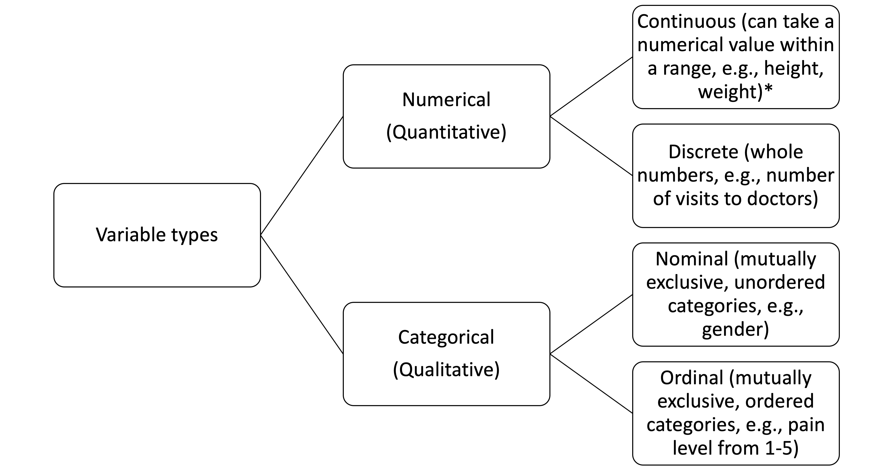
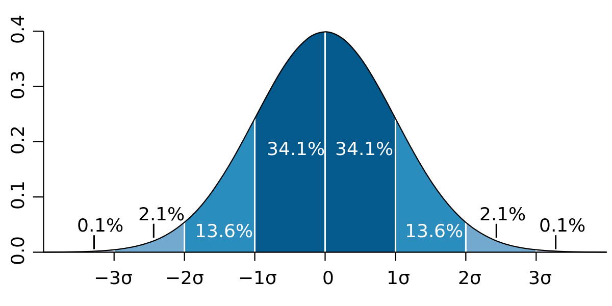
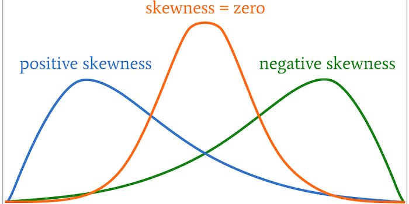
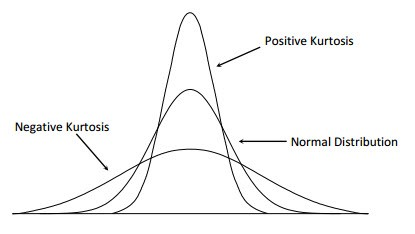

# 2. Descriptive statistics and variable types
Descriptive statistics, as its name suggests, is the kind of statistics that describes your data. Obviously, it would be hard to directly observe any meaningful patterns or get useful information by just looking at the raw data. With descriptive statistics, we could "describe" your data in a meaningful way, or even make initial assumptions about the phenomenon that you are investigating. Normally, descriptive statistical analysis covers three main aspects of a data set: 

| Characteristics| Measurement technique |
| :----: | :----:| 
| Center of the data set <br> (measurement of central tendency)| Mean, median, and mode |
| Spread of the data set <br> (measurement of variability)| Range, variance, and standard deviation| 
| Shape of how the data is distributed| Symmetry, skewness, and kurtosis| 

(Kubiak and Benbow, 2006, as cited in Kotu and Deshpande, 2019)
 
## 2.1 Observing the data set & types of variables
Before we really enter the analysis, let's take a look at the data that we will be using in this demonstration. Normally, it would be hard to look through the entire data set since there are so many entries in one data set (in the `sat.act` data set, there are 700 entries). To look at the first few rows of your data, use the `head()` function. 
``` {r class.source = "code1"}
library(psych)
library(knitr)
test_score <- sat.act

# Syntax: head(data_set)
kable(head(test_score)) # ignore the "kable()" function. It's just here to beautify the output in the website
```
We can see that the data consists of 700 rows (700 entries) and 6 variables: gender, education, age, ACT, SATV (SAT Verbal score), and SATQ (SAT Quantitative score). Here I'll use a table to describe the variables contained in this data set: 

|Variable|Description|
|:---:|---|
|gender| Male = 1, female = 2|
|education| Self-reported education 1 = high school .... 5 = graduate work|
|age| Age|
|ACT| ACT Composite scores ranging from 1 - 36|
|SATV| SAT Verbal scores ranging from 200 - 800|
|SATQ| SAT Quantitative scores ranging from 200 - 800| 

There are ways to categorize these variables to choose the right statstical tests/methdos of analysis for the variables. See the following chart to understand different types of variables:

For example, gender would be considered a categorical, nominal variable, while test scores would be considered quantitative, discrete variables (because they do not involve decimal numbers).

*:One thing to note that is, for those who will be doing research with Likert type questions (which is a type of ordinal data), you can analyze your data using methods designed for continuous variables since scholars have argued that if you take two or more ordinal variables and add them together, it could be an approximate of a continuous variable (Norman, 2010). 

## 2.2 Descriptive statistics analysis
Doing a descriptive statistics analysis is as simple as using only 1 function - the `describe()` function from the `psych` package. See the following example: 
``` {r class.source = "code1", class.output = "output", warning = FALSE}
# function to use: describe() 
# Syntax: describe(data)

# Example: 
library(knitr)
kable(describe(test_score)) #ignore the "kable()" function. It's just here to beautify the output in the website
```

And there you have the descriptive statistics for your data set! Note that although the program still gives outputs for the `gender` and `education` variable, they do not mean more, since `gender` and `education` are both categorical variables described in numeric format. 

## 2.3 Getting to know the outputs 
From this output table, we can see that the function gives us several outputs: `vars`, `n`, `mean`, `sd`, `median`, `trimmed`, `mad`, `min`, `max`, `range`, `skew`, `kurtosis`, and `se`. Below is a table showing the explanation for each output: 

|Output|Description|
|:---:|---------------|
|vars|Item number|
|n| Number of valid cases|
|Mean| The arithmetic average of all observations (values) in the data set. The mean of a given data set is calculated summing all data points and divide it by the number of data points in the data set. |
|sd|Stands for "Standard deviation". Higher SD means that your data is high in variability (spread widely around the central point of the data set). <br> <i>Derivation: SD is derived by taking the square root of the variance of the data set (variance: the sum of the squared deviations of all data points divided by the number of data points. Deviation is the difference between any given value in the data set and the mean of the sample) </i> <br>In the graph below, SD is denoted by "σ"<br>|
|median| Median stands for the "middle point" of your data. Median is obtained by sorting the values in your data set in ascending order and finding mid-point value.|
|trimmed| Stands for "trimmed mean" (also called "truncated mean"). Trimmed mean is calculated by "trimming" (i.e., discarding) a small percentage of the largest and smallest value before actually calculating the mean. The default trimming percentage in the `psych` package is 0.1, which means that the highest and lowest 10% of values in the data set will be removed before calculating the mean.| 
|mad|Stands for "Median absolute deviation". MAD is the average distance between each data point and the mean.|
|min| The minimum value in your data set |
|max| The maximum value in your data set|
|range| = max - min|
|skew| Stands for "skewness" <br>If your data is <strong>positively skewed</strong>, the mass of the distribution is concentrated on the left of the figure <br>If your data is <strong>negatively skewed</strong>, the mass of the distribution is concentrated on the right of the figure. |
|kurtosis| Kurtosis refers to the "peakedness" of the data distribution. If your data has a positive kurtosis (leptokurtic kurtosis), the distribution of your data would look more "pointed" or "peaked", while a negative kurtosis (platykurtic kurtosis) means that the distribution of the data looks "flat". See the picture below: <br> |
|se| Stands for "standard error." SE gives the accuracy of a sample mean by measuring the sample-to-sample variability of the sample mean. SE is calculated by dividing the SD by the square root of sample numbers (n) (i.e., $\sigma/\sqrt{n}$). <br> For example, see SATV SD = 112.9, then the SE of SATV = $112.9/\sqrt{700}\approx{4.27}$|

(Kissell and Poserina, 2017; Kotu and Deshpande, 2019)

## 2.4 Descriptive statistics by group

One common problem when doing descriptive statistics is that you want to know the descriptive statistics for a specific group (e.g., gender, age, education, etc.). To do so, you'll just have to add an extra argument in the `describeBy()` function. In the following example, I will use "gender" as the grouping variable and do a descriptive analysis.

``` {r class.source = "code1", class.output = "output", warning = FALSE}
# Syntax: describe(data ~ your_grouping variable)
# Note that the grouping variable has to be in the same variable as your data (i.e., in the same data frame)
describe(test_score ~ gender)
```

Another way to do this is to use the `describeBy()`function in the `psych` package. See the following example:
``` {r class.source = "code1", class.output = "output", warning = FALSE, eval = FALSE}
# Syntax: describeBy(data, data$column_name), the dollar sign helps you select a specific column from the data set
describeBy(test_score, test_score$gender)
```
This line of code gives the exact same output as the previous one. 

## 2.5 Reporting descriptive statistics
<ul>
<li><strong>What to report</strong>: Something to take note of while reporting the descriptive statistics of your data is that: <strong>you do not need to report everything.</strong> One standard practice when reporting descriptive statistics is to report 1 measurement of central tendency (mean) and 1 measurement of variability (standard deviation). </li>

<li><strong>Formatting your report</strong>: The MLA 8th edition does not seem to give any guidance on reporting results from statistical analysis. Thus, you might want to consider using APA to report your results. For more guidance on reporting statistical results, see [this page](https://www.scribbr.com/apa-style/numbers-and-statistics/)</li>
</ul>


That wraps up our discussion on descriptive statistics. You can choose to: <br>
[Go back to index](https://ludougan123234.github.io/Index.html) or <br>
[Go to the next chapter](https://ludougan123234.github.io/Chapter_3.html)


References: <br>
1. [Calculate kurtosis in Python (with examples) by Misha Sv on Towards data science](https://www.google.com/url?sa=i&url=https%3A%2F%2Ftowardsdatascience.com%2Fcalculate-kurtosis-in-python-with-examples-pyshark-2b960301393&psig=AOvVaw2J9zMsbiia9CUR7x8xQ21-&ust=1633834612782000&source=images&cd=vfe&ved=0CAwQjhxqFwoTCJjW8K-qvPMCFQAAAAAdAAAAABAJ)<br>
2. [Picture showing the standard deviation - Wikipedia](https://www.google.com/url?sa=i&url=https%3A%2F%2Fen.wikipedia.org%2Fwiki%2FStandard_deviation&psig=AOvVaw21KvAZMmHVNv89AJzW9ABY&ust=1633834713208000&source=images&cd=vfe&ved=0CAwQjhxqFwoTCJibx9-qvPMCFQAAAAAdAAAAABAD)<br>
3. [Understanding Parametric Tests, Skewness, and Kurtosis by Robert Keim](https://www.allaboutcircuits.com/technical-articles/understanding-the-normal-distribution-parametric-tests-skewness-and-kurtosis/)<br>
4. Kissell, R., & Poserina, J. (2017). Chapter 4 - Advanced Math and Statistics. In R. Kissell & J. Poserina (Eds.), Optimal Sports Math, Statistics, and Fantasy (pp. 103-135). Academic Press. https://doi.org/https://doi.org/10.1016/B978-0-12-805163-4.00004-9 <br>
5. Kotu, V., & Deshpande, B. (2019). Chapter 3 - Data Exploration. In V. Kotu & B. Deshpande (Eds.), Data Science (Second Edition) (pp. 39-64). Morgan Kaufmann. https://doi.org/https://doi.org/10.1016/B978-0-12-814761-0.00003-4 <br>
6. Norman, G. (2010). Likert scales, levels of measurement and the “laws” of statistics. Advances in Health Sciences Education, 15(5), 625-632. https://doi.org/10.1007/s10459-010-9222-y 
