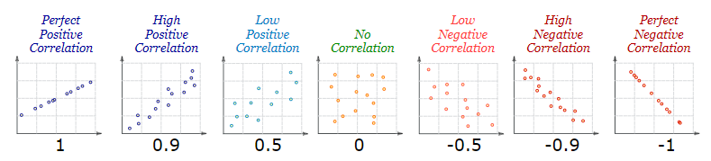

# Chapter 4. Correlation and regression

Your research might deal with a research question like  "what is the <strong>correlation</strong> between x and y" or "how do x and y predict z". With this type of question, we have to use "correlation analysis" and "regression analysis" to investigate the relationship between your research variables. Although correlation analysis is also considered a type of descriptive statistical analysis, correlation involves multivariate explorations. Thus, I decided to separate correlation analysis from descriptive statistics. In this chapter, I will go through how to do a correlation analysis, using the same `sat.act` data set, and how to interpret the outputs from the program.

## 4.1 Correlation analysis 

If you would like to investigate the correlation between <strong>2 continuous variables (not categorical)</strong>, then correlation analysis would be suitable. There are 2 types of correlation analysis: <strong>Pearson product moment correlation</strong>, and <strong>Spearman correlation</strong>. 

### 4.1.1 Pearson product-moment correlation and p-value
One of the most commonly used correlation analyses is Pearson product-moment correlation. This analysis assumes that your variables have <strong>a linear relationship and are normally distributed</strong>. Although from the previous section we know that the `ACT`, `SATV`, and `SATQ` columns in the `sat.act` data set is not normally distributed, I will still demonstrate Pearson's correlation using this data set for convenience. 

The function for Pearson's correlation in R is `cor.test()`. Let's say, we want to investigate the correlation between SAT Verbal scores and SAT Quantitative scores. See the following demonstration: 

``` {r class.source = "code1", class.output = "output"}
# load data set
test_score <- psych::sat.act
# load library
library(stats)

# Syntax: cor.test(variable1, variable2)
cor.test(test_score$SATV, test_score$SATQ)
```

We focus on 2 outputs: the `cor` and the `p-value`. In this output, we see that the correlation coefficient (cor) $\approx 0.64$. This means that there is a <strong>positive correlation (r = 0.64)</strong> between SATV and SATQ scores. See how to interpret correlation coefficient in the image below: 


[Source of image](https://www.google.com/url?sa=i&url=https%3A%2F%2Fbusinessq-software.com%2F2019%2F02%2F21%2Fscatter_plot%2F&psig=AOvVaw0e_bBP9U_CUhnOiVehwdB8&ust=1633938008097000&source=images&cd=vfe&ved=0CAwQjhxqFwoTCND9n8arv_MCFQAAAAAdAAAAABAd)

Aside from the correlation coefficient, another output to take note of is the <strong>p-value</strong>. In hypothesis testing, there are two types of hypotheses: Null hypothesis ($H_0$) and Alternative hypothesis ($H_1$). Null hypothesis states that a parameter is equal to a hypothesized value (in Pearson correlation, this value is 0). Alternative hypothesis, on the other hand, states that a parameter is different from a hypothesized value and is often what you hope to prove true. If p-value > 0.05, this means that we've failed to reject $H_0$, and your result will bes considered statistically insignificant. If p-value < 0.05, this means that we've rejected $H_0$ successfully and that we have enough confidence in accepting $H_1$. In this case, we would say that the result has "statistical significance".

In more rigorous cases, the threshold might be much smaller than 0.05. However, in the field of applied linguistics and social science, 0.05 seems to be good enough for most cases, and thus 0.05 has become the de facto p-value threshold. 

Combining the results, we say that there is a <strong>statistically significant, positive correlation</strong> between SATV and SATQ scores. This means that those who score higher on SATV tend to score higher on SATQ.

### 4.1.2 Spearman Correlation
Spearman correlation is a different version of Pearson correlation in that it <strong>does not assume normality in your data</strong>. Other than that, Spearman correlation does not seem to differ largely from Pearson correlation. The function for Spearman correlation test is the same as Pearson correlation test, with only one additional argument to add in the `cor.test` function.
``` {r class.source = "code1", class.output = "output", warning = FALSE}
# Syntax: cor.test(variable1, variable2, method = "spearman")
cor.test(test_score$SATV, test_score$SATQ, method = "spearman")
```

And there you have it! The interpretation of Spearman correlation is the same as Pearson correlation. See section 4.1.1 for guides on interpreting your results. 

### 4.1.3 Correlation matrix 
If you have multiple variables that you would like to do correlation analysis on, it would be inefficient to do the analysis one by one. The fastest way to do multiple correlation analyses is to construct a correlation matrix. In R, constructing a correlation matrix is very simple, using the `corr.test()` function from the `psych` package. See the following example:

``` {r class.source = "code1", class.output = "output", warning = FALSE}
# select the columns that contains only the test scores
library(psych)
test_score <- psych::sat.act
test_score <- test_score[, c(4:6)]
# Syntax: corr.test(data, method = "pearson" or "spearman")
corr.test(test_score)
```
The function gives us 3 outputs: `correlation matrix`, `sample size` and `probability values`. You can directly observe the correlation coefficient from the matrix, and the p-value from the `probability values` section


## 4.2 Multiple linear regression
Previously, we've talked about correlation between 2 variables. Now we will move on to multiple linear regression, which is a technique to estimate the relationship between two or more independent variable (predictor) and one dependent variable. It might be simpler to understand this in mathematical equations: 

$y = \beta_0 + \beta_1X_1 + ... + \beta_nX_n + \epsilon$
<br><ul>
<li> $y$ refers to the value of your dependent variable (variable that is subject to changes in the independent variables)</li>
<li>$\beta_0$ the y-intercept, or the value when all other parameters are set to 0</li>
<li>$\beta_1 ... \beta_n$ the regression coefficient of $X_1...X_n$</li>
<li>$X_1...X_n$: independent variables</li>
<li>$\epsilon$ model error term
</ul>

Now, let's say we would like to predict ACT scores with SATQ and SATV scores (that is, ACT scores are the dependent variable, and SATQ and SATV scores are the independent variable), we could do this by building a linear model using `lm()` function: 
``` {r class.source = "code1", class.output = "output", warning = FALSE}
# Syntax: lm(formula)
# Formula syntax: dependent_variable ~ independent_variable1 + independent_variable2 + ...+ independent_variable_n

# first, we construct and store the model onto a variable called score_lm
score_lm <- lm(test_score$ACT ~ test_score$SATQ + test_score$SATV)

# then, we use the summary() function to "summarize" the model
summary(score_lm)
```

From the `residuals` section, we can see that the minimum and maximum are around -17 and 18, with the median being 0.08. This is probably a good sign that the model fits the assumption of homoscedacity. <br>
We then focus on the `coefficients` section of the output, where we construct the mathematical equation that describes the relationship between ACT, SATV, and SATQ scores. First we look at the `(Intercept)`. This is the y-intercept of the formula. Then, we look at the `Estimate` of SATQ and SATV. `0.016142` and `0.013284` are the regression coefficient of SATQ and SATV, respectively. So, from this output, we can construct that: <br> $ACT \space score = 10.57 + (0.02 * SATQ) + (0.01 * SATV)$ 

Since that the p-values (`Pr(>|t|)`) are all less than 0.05, we can say that SATQ and SATV are both statistically significant indicators of ACT scores. 

And that wraps up our discussion on correlation and linear regression. You can choose to <br> [Go back to the main page](https://ludougan123234.github.io/Index.html) or <br> [Go to the next chapter](https://ludougan123234.github.io/Chapter_5.html)


References:
1. [Correlation types and when to use them](https://ademos.people.uic.edu/Chapter22.html)
2. [Multiple linear regression by Rebecca Bevans](https://www.scribbr.com/statistics/multiple-linear-regression/)
3. [Null hypothesis and alternative hypothesis by Minitab 18 support](https://support.minitab.com/en-us/minitab/18/help-and-how-to/statistics/basic-statistics/supporting-topics/basics/null-and-alternative-hypotheses/#:~:text=The%20null%20hypothesis%20states%20that,equal%20to%20a%20hypothesized%20value.&text=The%20alternative%20hypothesis%20is%20what,or%20hope%20to%20prove%20true.)
